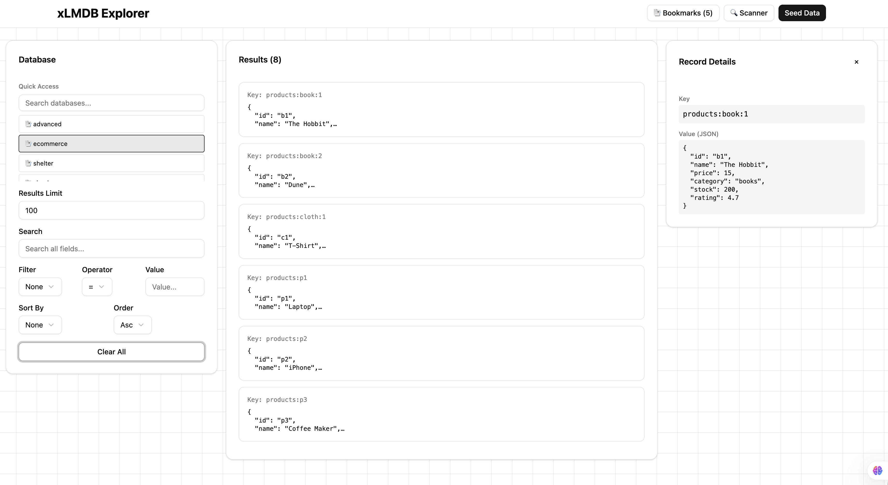
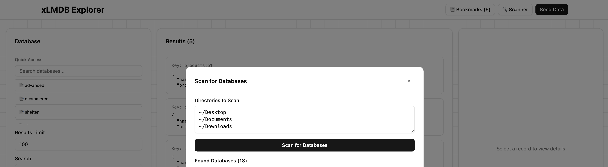
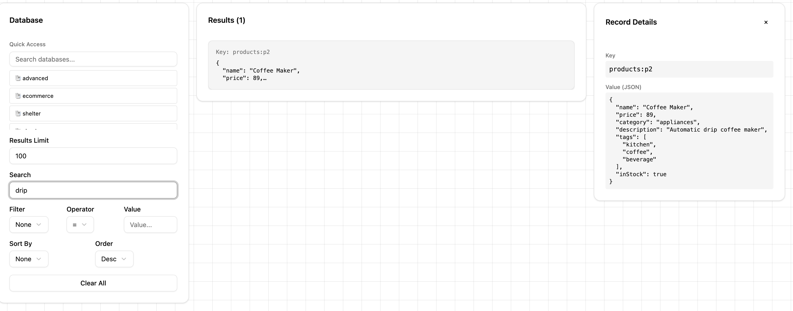
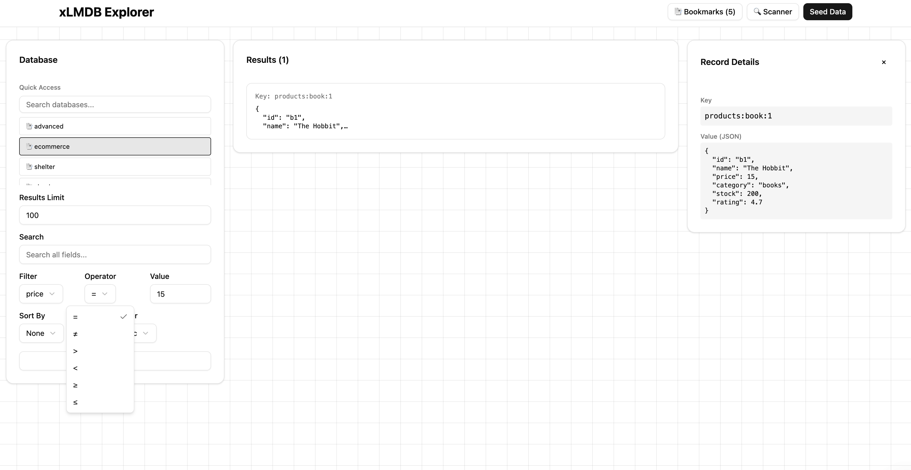

# Local LMDB Database Explorer

A local web UI for exploring LMDB databases with search, filtering, and sorting capabilities.

> **Note**: This project was originally created to test and demonstrate the search functionality of the [xlmdb](https://www.npmjs.com/package/xlmdb) library.

## Screenshots

### Main Interface

*Browse and explore your LMDB databases with an intuitive three-column layout.*

### Automatic Database Scanner

*Automatically scan directories to discover all `.mdb` database files.*

### Deep Search

*Search across all fields in your database records, including nested objects and arrays.*

### Advanced Filtering

*Filter records by field values using various operators (=, !=, >, <, >=, <=).*

## Quick Start

```bash
# Install dependencies
bun install

# Start development server
bun run dev
```

Open `http://localhost:3000` in your browser.

## Features

- **🔍 Deep Search** - Search across all fields in database records (nested objects and arrays supported)
- **🎯 Advanced Filtering** - Filter by field values with operators: `=`, `!=`, `>`, `<`, `>=`, `<=`
- **📊 Custom Sorting** - Sort results by any field in ascending or descending order
- **🔎 Automatic Database Scanner** - Recursively scan directories to find all `.mdb` files
- **📑 Bookmarks** - Save and quickly access your favorite databases
- **⚡ Real-time Updates** - Instant search results as you type
- **📈 Result Limiting** - Control how many results are displayed
- **🌱 Sample Data** - Seed the database with sample products for testing

## Usage

1. **Load a Database**: 
   - Click "Scanner" to automatically find all `.mdb` databases in specified directories
   - Or manually load a database by providing its path
   - Bookmark frequently used databases for quick access
2. **Search**: Enter text in the search box to search across all fields
3. **Filter**: Select a field, operator, and value to filter results
4. **Sort**: Choose a field and sort order
5. **View Details**: Click any record to see full details in the right panel
6. **Seed Data**: Click "Seed Data" to populate with sample products (for testing)

## Production Build

Build the project for production:

```bash
bun run build
```

The built files will be in the `dist/` directory.

Run the production server:

```bash
bun run start
```

## Configuration

Environment variables:

- `DB_PATH` - Default database path (default: `./data`)
- `PORT` - Server port (default: `3000`)

Example:

```bash
DB_PATH=./custom/path PORT=8080 bun run dev
```

For production:

```bash
DB_PATH=./custom/path PORT=8080 bun run start
```

## Tech Stack

- **Bun** - Runtime and server
- **React 19** - UI framework
- **Tailwind CSS** - Styling
- **xlmdb** - LMDB search library
- **shadcn/ui** - UI components

## License

MIT
